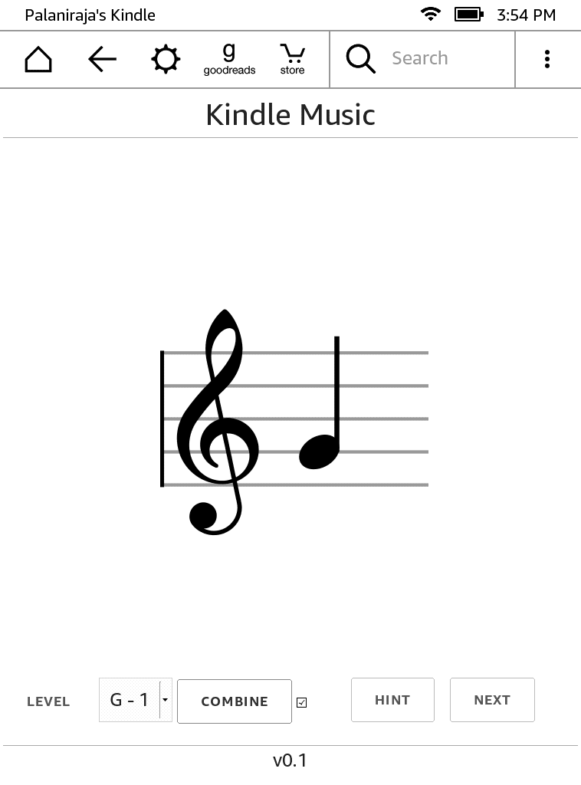

# Kindle Music

Visit [http://www.palaniraja.com/kmusic/](http://www.palaniraja.com/kmusic/) from your Kindle Experimental browser. You can also bookmark the page for quick access.

Offline friendly website for sight reading - similar to https://github.com/palaniraja/music-notes but for kindle

Tested only in Kindle Paperwhite.

### Screenshot

### Todo

- [x] Flashcards
    - [ ] Add Bass staff
- [x] Choose level
    - [ ] Add Bass staff
- [ ] Leader board - Keep top 5 scores

### Release Notes

#### 2017-03-29

* Initial version released
* Visit http://www.palaniraja.com/kmusic/ 
* Page should be available even when you are offline.
